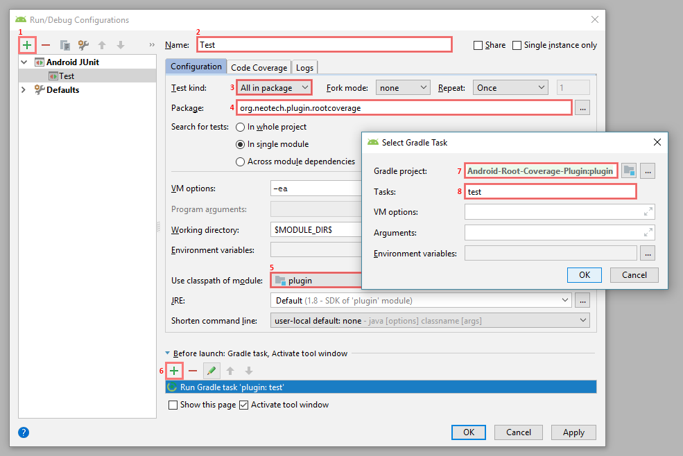

[](https://plugins.gradle.org/plugin/org.neotech.plugin.rootcoverage)
[](https://travis-ci.com/NeoTech-Software/Android-Root-Coverage-Plugin/)

# Android-Root-Coverage-Plugin
**A Gradle plugin for combined code coverage reports for Android projects.**
Generating code coverage reports for Android Projects is in most cases quite easy. Unfortunately by
default (using Jacoco) code coverage is generated separately per module. This means each module
takes into account it's own sources and tests (which is in terms of domain separation fine). However
it is very common to find multi-module Android projects where only one module actually has tests.
This plugin comes in handy for those projects. It generates code coverage reports using Jacoco
taking into account all the modules and tests at once, or in other words: code in module B will show
up as "covered" when tests in Module A touch it.

  - Supports both Android app and library modules (`com.android.application` & `com.android.library`).
  - Supports different build variants per module within the same report.
  - Supports custom package/class filters.


# Setup
Apply the Android-Root-Coverage-Plugin plugin to your top-level (root project) gradle file:

```groovy
// Step 2: Apply the plugin to the top-level gradle file
apply plugin: 'org.neotech.plugin.rootcoverage'

buildscript {
    dependencies {
        // Step 1: add the dependency
        classpath 'org.neotech.plugin:android-root-coverage-plugin:1.3.0'
    }
}
```


# How to use
Currently only modules with the plugin type `com.android.application` or `com.android.library` are
taken into account when generating the coverage report, besides this any module that does not have
`testCoverageEnabled true` for the selected build variant (by default: `debug`) will be skipped:

You can add a module by enabling `testCoverageEnabled`:
```groovy
android {
    buildTypes {
        debug {
            testCoverageEnabled true
        }
    }
}
```

The Android-Root-Coverage-Plugin generates a special Gradle task `:rootCodeCoverageReport` that when
executed generates a Jacoco code coverage report. You can either run this task directly from
Android Studio using the Gradle Tool Window (see:
<https://www.jetbrains.com/help/idea/jetgradle-tool-window.html>) or from the terminal.

- **Gradle Tool Window:** You can find the task under: `Tasks > reporting > rootCodeCoverageReport`, double click to  execute it.
- **Terminal:** Execute the task using `gradlew rootCodeCoverageReport`.


# Compatibility
| Version       | Android Gradle plugin version | Gradle version |
| ------------- | ----------------------------- | -------------- |
| **1.3.0**     | 3.6                           | 5.6.4+         |
| **1.2.1**     | 3.5                           | 5.4.1+         |
| **1.1.2**     | 3.4                           | 5.1.1+         |
| **1.1.1**     | 3.3                           | 4.10.1+        |
| ~~**1.1.0**~~ | ~~3.3~~                       | ~~5+~~         |
| **1.0.2**     | 3.2                           | 4.6+           |

*Note: This plugin normally supports exactly the same Gradle versions as the Android Gradle
plugin, for more information please refer to:* 
<https://developer.android.com/studio/releases/gradle-plugin#updating-gradle>

Android Gradle Plugin versions before `3.4.0-alpha05` are affected by a bug that in certain conditions can
cause Jacoco instrumentation to fail in combination with inline kotlin methods shared across modules. For more information
see: <https://issuetracker.google.com/issues/109771903> and <https://issuetracker.google.com/issues/110763361>.
If your project is affected by this upgrade to an Android Gradle Plugin version of at least `3.4.0-alpha05`.


# Configuration
By default the plugin generates code coverage reports using the build variant `debug` for every
module. However in some cases different build variants per module might be required, especially if
there is no `debug` build variant available. In those cases you can configure custom build variants
for specific modules:

```groovy
rootCoverage {
    // The default build variant for every module
    buildVariant "debug"
    // Overrides the default build variant for specific modules.
    buildVariantOverrides ":moduleA" : "debugFlavourA", ":moduleB": "debugFlavourA"
    
    // Class exclude patterns
    excludes = ["**/some.package/**"]

    // Since 1.2: When false the plugin does not execute any tests, useful when you run the tests manually or remote (Firebase Test Lab)
    executeTests true
    
    // Since 1.2: Same as executeTests except that this only affects the instrumented Android tests
    executeAndroidTests true

    // Since 1.2: Same as executeTests except that this only affects the unit tests
    executeUnitTests true

    // Since 1.2: When true include results from instrumented Android tests into the coverage report
    includeAndroidTestResults true

    // Since 1.2: When true include results from unit tests into the coverage report
    includeUnitTestResults true
}
```


# Development
Want to contribute? Great! Currently this plugin is mainly in need of extensive testing in some more
projects. But if you like to add some actually functionality, this is the wish list:

- Support for Java library modules
- Make use of the JacocoMerge task? To merge the `exec` en `ec` files?
- Improved integration test setup: without the hackish dynamic versions in the Gradle plugin block?

**How to test your changes/additions?**
The plugin comes with an integration test. You can run this test either by executing
`gradlew clean test` or run the test directly from Android Studio (or IntelliJ IDEA) using a proper run/test
configuration as shown in the image *(by default it generates configuration that is not compatible
with a plugin module)*:



# Author note
Many thanks to [Hans van Dam](https://github.com/hansvdam) for helping with testing and the initial idea.
